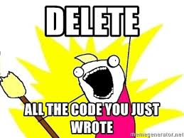

Javascript: A New Experience
Javascript so far has been an interesting language to experience. As a complete newbie, taking the Free Code Camp lessons definitely helped me to quickly learn the syntax for Javascript (and a little bit of accidentally learning some HTML). I found the structure of the Free Code Camp lessons to be extremely helpful because if the student can quickly figure out what the lesson is testing or asking the user to do, an individual can breeze through the lessons. 
	I enjoy the athletic software engineering exercises. The stress introduced due to the time pressures of WOD’s is actually a strong motivator for someone like me who needs a little bit of a push to code quickly. The practice WODs were helpful in getting used to the time pressure, practicing syntax, and getting back into writing code again. 
	On the other hand, I feel proper code is an art form. Being in this rushed environment seems okay for now but I worry about later on in the course when the material gets a little more difficult. Hopefully by that time I’ll have done enough WODs to be confident in my abilities and proficient in completing the WODs in the time allotted.

