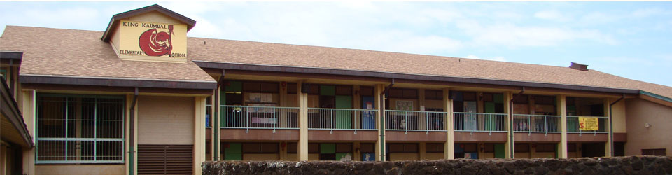

  

Every year, Key Club, a high schooler run community service club, hosts H-Con (Hawaii Convention), that invites all the schools in Hawaii to enjoy President's Day weekend together. Activities at the convention include seminars where students can learn leadership skills, a service project, and a talent show. In 2014, Kauai High was tasked with the preparations for the next convention. These tasks included set up, decorations, events, and facilitating the experience.  

For this project, I was asked to primarily work on decorations alongside the commitee members of the Kauai High School Key Club. For the decorations, we were going for an Under the Sea/Beach theme. I spent countless weekends and nights working with my other club members on decorations such as jellyfish lanterns, backgrounds, PVC pipe work, and cutting miles of cardboard into the shapes we needed. Thankfully we were eventually able to complete all these tasks by the event date. 

 During the event, I spent a lot of my time helping to facilitate the various seminars acting as a runner to grab various needed supplies or hunt down presenters who might be running late. The service project for this year was helping to clean up the local elementary school. There I helped to make sure each group had the proper tools and were working in the correct areas.

