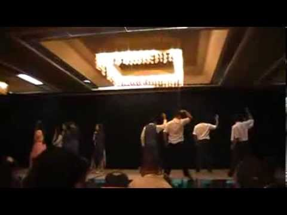

Alongside the Key Club Convention planning I, along with a few other students, was asked to help plan our school's talent show performance. As is tradition for the Kauai High School Key Club, any and every person going to the convention must participate in the talent show. For our club it's more about the combined effort we all put in to making a fun performance for everyone than actually winning the talent show. Leading up to my tenure as head coordinator for the talent show, Kauai High had won the talent show every year. My team and I were determined to continue our record with this performance. 

The four coordinators were given a group to lead. Each group was also given a theme for their performance. Kauai High normally does dances and this year was no exception. I pitched the idea to everyone that our performance should be based around the film "Teen Beach Movie." As my fellow coordinators and I are not particularly skilled at dancing we enlisted the help of some members of the local dance club to help choreograph. I acted as the primary liaison between the dance club and our groups. We spent a few weeks over the spring break working on the dances, drilling over and over. It was a rough experience to lose but it was a good learning experience for me. 

Here is a video of the final performance: https://www.youtube.com/embed/Ppjiu8eqOfs
