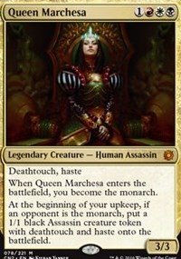

I play Magic the Gathering which is one of the oldest trading card games. I've recently got into a format of Magic known as commander.  The commander format is a more casual version of Magic where people play with larger deck sizes, specifically it is a format where a person's deck consists of 100 cards. Each commander deck has a leader of the deck known as the decks commander. A commander can be any legendary creature from Magic's history. There are hundreds of commanders to choose from. My personal commander is Queen Marchesa. In commander the cards in your deck are limited to the color identity of your commander. Color identity is determined through the colored mana symbols visible on the card (excluding reminder text). Queen Marchesa is in the color shard of Mardu which consists of the colors, Black, White, and Red. 

Commander is a 40 life format as opposed to the normal 20 life. This is to help ensure people have time to play their cards. My Queen Marchesa deck chooses to take advantage of this through the use of her ability called monarch. When Queen Marchesa is played, I become the monarch. Monarch is a mechanic that allows a player to draw a card from their deck at the end of their turn. The monarchy passes through combat damage being dealt to the monarch. With this mechanic in mind, this is how I constructed my commander deck. I have many cards in my deck designed to make it difficult for my opponents to attack me.  Many of my spells force my opponents to pay mana or life in an attempt to attack me. Many of my creatures also make it so that it's difficult for my opponents to cast their own spells by increasing the amount of resources that are required to cast those spells. 

To win the game, my deck focuses on nickel and diming my opponents until I win the war of attrition. As I am continuosuly drawing cards the game continuously moves in my favor as I have a stockpile of resources to bash my opponents with. I consider this deck one of my projects as I view building and playing it as a continual process that requires refinement, play testing, stress testing, and efficient answers (my cards) to problems (my opponent's cards). This deck thrives in an environment where I have complete control over who gets to play what cards. 

I also play this deck with another aspect of commander and multiplayer games in mind, politics. Given the nature of my decks construction, most players at the table will dislike me because they don't like that I'm making it difficult for them to play their cards. This means I must play a stronger mental game than my opponents and make sure that I point out other threats on the board other than myself. With the way my deck is constructed I have to pit my opponents against each other rather than play just the cards themselves. Any deck will fold against multiple players attacking me so it's defintiely important to make sure that I dodge or deflect people's aggression away from me.

This deck is still a work in progress though as I don't have an infinite amount of money to spend on Magic cards. Thankfully I have been able to find a few friends on campus who play commander. I'm excited to continue getting games in with them and continuing to iterate on my commander deck!
